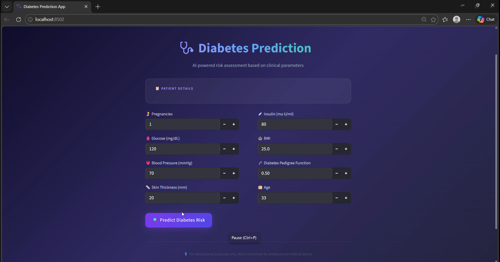
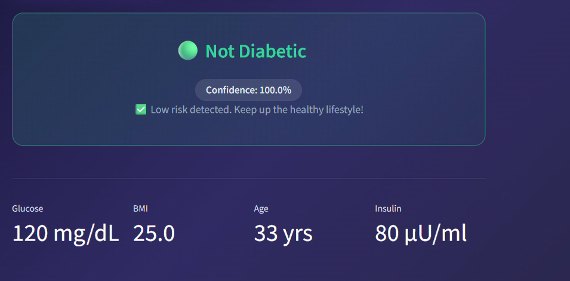
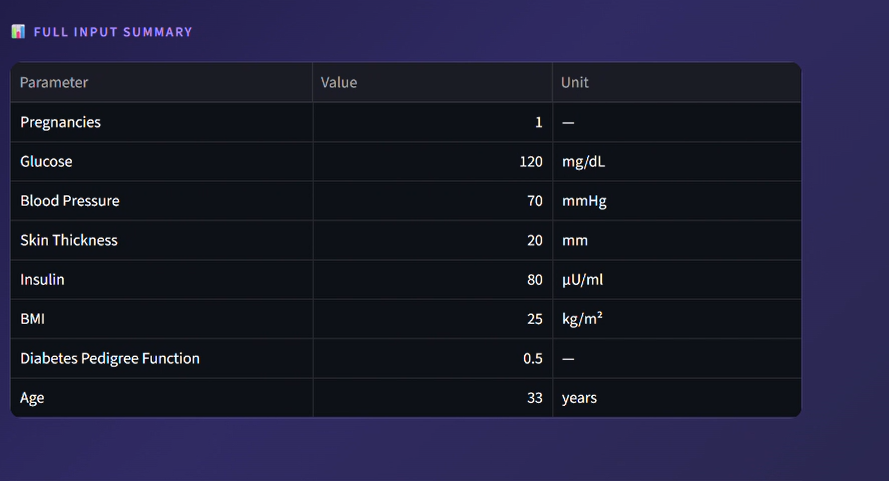

# 🩺 Diabetes Prediction Web App

A complete end-to-end Machine Learning web application that predicts whether a person is diabetic or not based on medical input features. This project demonstrates a full ML pipeline including data preprocessing, model training, evaluation, and deployment with an interactive web interface.

---

## 🚀 Features

* Predicts diabetes using a trained Machine Learning model
* Clean and modular project structure
* End-to-end ML pipeline (training → saving → deployment)
* Interactive and modern UI
* Uses real-world dataset (PIMA Indians Diabetes Dataset)
* Displays prediction with confidence score and input summary

---

## 📊 Input Features

The model uses the following medical parameters:

* Pregnancies
* Glucose Level
* Blood Pressure
* Skin Thickness
* Insulin Level
* Body Mass Index (BMI)
* Diabetes Pedigree Function
* Age

---

## 🧠 Model Details

* Algorithm: **RandomForestClassifier**
* Data Preprocessing: **StandardScaler**
* Train-Test Split: **80% / 20%**
* Evaluation Metric: **Accuracy Score**

---

## 📈 Model Performance

* Accuracy: **~75% (approx)**
* Stratified data split for balanced classes
* Feature scaling applied to prevent data leakage

---

## 💡 How It Works

1. User enters medical parameters
2. Input data is scaled using StandardScaler
3. Trained model predicts diabetes risk
4. Result is displayed with confidence score
5. Full input summary is shown to the user

---

## 🗂️ Project Structure

```
Diabetes-App/
│── app/
│   └── app.py                # Web application
│
│── model/
│   ├── model.pkl            # Trained ML model
│   └── scaler.pkl           # Saved scaler
│
│── data/
│   └── diabetes.csv         # Dataset
│
│── notebooks/
│   └── training.py          # Model training script
│
│── screenshots/             # Application images
│   ├── home.png
│   ├── result.png
│   └── summary.png
│
│── README.md
│── requirements.txt
```

---

## ⚙️ Installation & Setup

### 1️⃣ Clone the Repository

```bash
git clone https://github.com/Emanojroshan/Diabetes-App.git
cd Diabetes-App
```

### 2️⃣ Install Dependencies

```bash
pip install -r requirements.txt
```

---

## 🏋️ Train the Model

```bash
cd notebooks
python training.py
```

This will:

* Train the model
* Save `model.pkl` and `scaler.pkl` in the `model/` folder

---

## ▶️ Run the Application

```bash
cd app
python app.py
```

Then open your browser and visit:

```
http://127.0.0.1:5000/
```

---

## 🖥️ Application Preview

### 🏠 Home Interface



### 📊 Prediction Result



### 📋 Input Summary



---

## ⚠️ Disclaimer

This application is for educational purposes only and should not be considered as medical advice or diagnosis.

---

## 🔮 Future Improvements

* Add multiple model comparison (Logistic Regression, SVM, etc.)
* Improve UI/UX design further
* Deploy application on cloud (Render / Streamlit Cloud)
* Add model explainability (SHAP)
* Add input validation and error handling

---

## 👨‍💻 Author

**Emanojroshan**

* GitHub: https://github.com/Emanojroshan
* LinkedIn: (Add your LinkedIn link)

---

## ⭐ Support

If you like this project, consider giving it a ⭐ on GitHub!
